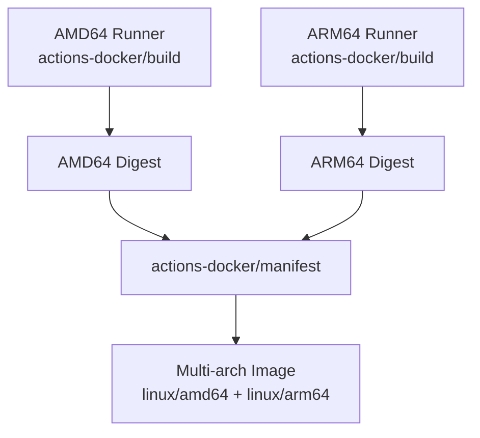

# actions-docker

GitHub Actions for building, pushing and tagging docker images.

## Actions

### [build](./build)

Build and push Docker images with native or cross-platform support.

### [manifest](./manifest)

Combine platform-specific Docker images into a single multi-arch manifest.

## Multi-Architecture Builds

Build Docker images for multiple architectures (AMD64, ARM64) using native runners for optimal performance.

### Workflow Pattern



### Why Multi-Arch?

1. **Native Builds Performance**: Build each platform on native runners (ARM64 on ARM, AMD64 on AMD) for maximum performance
2. **Explicit Control**: Explicit manifest creation gives you full control over the multi-arch image
3. **Multiple Tags**: Apply multiple tags (e.g., version + latest) in one step
4. **Clean Workflow**: Separate build and manifest creation concerns

### Complete Example

```yaml
jobs:
  build-amd64:
    runs-on: ubuntu-latest
    steps:
      - name: Checkout
        uses: actions/checkout@v4

      - name: Build AMD64
        uses: open-turo/actions-docker/build@v1
        id: build
        with:
          dockerhub-user: ${{ secrets.DOCKER_USERNAME }}
          dockerhub-password: ${{ secrets.DOCKER_PASSWORD }}
          # Omit image-version to push by digest only (no tags)
          # Or provide image-version: 1.0.0-amd64 for architecture-specific tags
          image-platform: linux/amd64
          push: true

    outputs:
      digest: ${{ steps.build.outputs.digest }}

  build-arm64:
    runs-on: ubuntu-arm-runner # Native ARM64 runner
    steps:
      - name: Checkout
        uses: actions/checkout@v4

      - name: Build ARM64
        uses: open-turo/actions-docker/build@v1
        id: build
        with:
          dockerhub-user: ${{ secrets.DOCKER_USERNAME }}
          dockerhub-password: ${{ secrets.DOCKER_PASSWORD }}
          # Omit image-version to push by digest only (no tags)
          # Or provide image-version: 1.0.0-arm64 for architecture-specific tags
          image-platform: linux/arm64
          push: true

    outputs:
      digest: ${{ steps.build.outputs.digest }}

  create-manifest:
    needs: [build-amd64, build-arm64]
    runs-on: ubuntu-latest
    steps:
      - name: Create multi-arch manifest
        uses: open-turo/actions-docker/manifest@v1
        with:
          image-name: myorg/myimage
          dockerhub-user: ${{ secrets.DOCKER_USERNAME }}
          dockerhub-password: ${{ secrets.DOCKER_PASSWORD }}
          tags: 1.0.0,latest
          sources: |
            myorg/myimage@${{ needs.build-amd64.outputs.digest }}
            myorg/myimage@${{ needs.build-arm64.outputs.digest }}
```

### How It Works

1. **Build Phase**: Each platform (AMD64, ARM64) is built separately on native runners
2. **Push Phase**: Each platform-specific image is pushed to the registry
   - **Digest-only push**: Omit `image-version` to push without creating tags (cleanest approach)
   - **Architecture-tagged push**: Provide `image-version` with arch suffix (e.g., `1.0.0-amd64`) for intermediate tags
3. **Manifest Phase**: The manifest action combines the platform images using their digests into a single multi-arch manifest
4. **Pull Phase**: When users pull the image, Docker automatically selects the appropriate platform-specific image

### Notes

- **Digest-only Builds**: When `image-version` is omitted, images are pushed by digest only without creating tags. This is the cleanest approach for multi-arch workflows as only the final manifest creates user-facing tags.
- **Digests vs Tags**: Using digests (e.g., `@sha256:...`) is more reliable than tags as it ensures you're referencing the exact image that was built
- **Multiple Tags**: You can create multiple tags for the same manifest (e.g., `1.0.0` and `latest`) by providing a comma-separated list
- **Native Performance**: Cross-platform builds using QEMU are significantly slower than native builds. Use native runners when possible.
